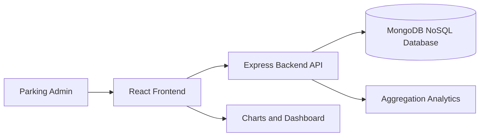

# Implementation Steps

## 1. Problem Selection

Selected problem: Cloud-Based Smart Parking Management and Analytics System.

Reason: Parking systems generate continuous operational data such as vehicle entry, exit, occupancy, payment, violation, vehicle category, location demand, and sensor health. This makes the topic suitable for cloud deployment and analytics.

## 2. System Architecture



## 3. Backend Implementation

1. Create an Express.js server.
2. Connect to MongoDB with Mongoose.
3. Define NoSQL schemas:
   - ParkingLot
   - ParkingSession
4. Create REST APIs for parking lots, sessions, and analytics.
5. Implement check-in validation:
   - Lot must exist.
   - Vehicle cannot already be active.
   - Lot must have available capacity.
6. Implement check-out logic:
   - Calculate duration.
   - Calculate fee using hourly rate.
   - Mark payment as paid.
7. Add analytics aggregation endpoints.

## 4. Frontend Implementation

1. Create a Vite React app.
2. Build a dashboard with:
   - KPI cards.
   - Check-in form.
   - Hourly demand line chart.
   - Lot revenue bar chart.
   - Vehicle mix pie chart.
   - Parking lots grid.
   - Recent sessions table.
3. Connect frontend to backend APIs with `fetch`.
4. Refresh dashboard after check-in/check-out.

## 5. Database Seeding

The seed file creates:

- 5 parking lots.
- 240 historical and active parking sessions.
- Mixed vehicle types.
- Payment, revenue, and violation data.

Run:

```bash
cd backend
npm run seed
```

## 6. Dockerization

The project includes:

- Backend Dockerfile.
- Frontend Dockerfile.
- Nginx configuration for serving React build.
- Docker Compose file with MongoDB, backend, and frontend.

Run:

```bash
docker compose up --build
```

## 7. Cloud Deployment

Use MongoDB Atlas for the managed NoSQL database, then deploy backend and frontend to Render, AWS, Google Cloud, or Azure. Detailed steps are in `DEPLOYMENT.md`.

cd "C:\Users\venug\Downloads\smart-parking-cloud"
docker compose up --build


cd "C:\Users\venug\Downloads\smart-parking-cloud"
docker compose exec backend node src/seed/seed.js

http://localhost:8080

mongodb://localhost:27017


